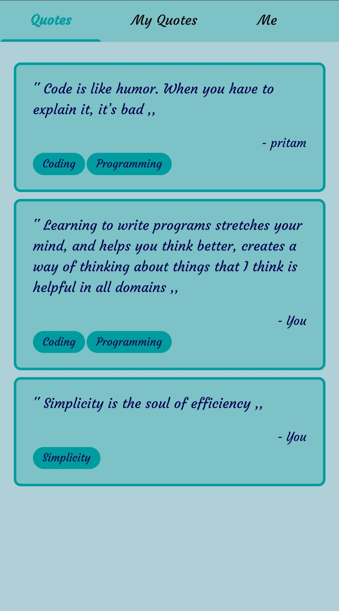

<pre style="display: inline-block; width:0px; text-align: left; text-decoration: none; " >
   ____              __          __ __                             ___ 
  / __ \__  ______  / /____     / //_/__  ___  ____  ___  _____   |__ \
 / / / / / / / __ \/ __/ _ \   / ,< / _ \/ _ \/ __ \/ _ \/ ___/   __/ /
/ /_/ / /_/ / /_/ / /_/  __/  / /| /  __/  __/ /_/ /  __/ /      / __/ 
\___\_\__,_/\____/\__/\___/  /_/ |_\___/\___/ .___/\___/_/      /____/ 
                                           /_/                         

 
</pre>

<h2>Live 🔴 </h2>

### [Quotes Keeper 2](https://quote-keeper-2.netlify.app/all-quote-list)

##### https://quote-keeper-2.netlify.app/all-quote-list

